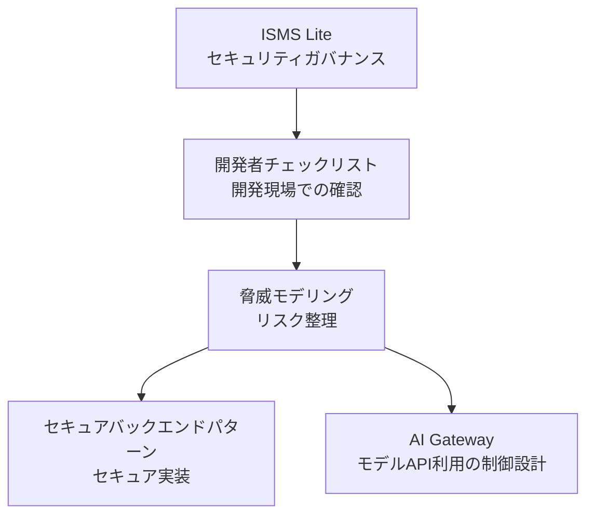

# Startup Security Kit

スタートアップや小規模チーム向けに、**軽量 ISMS・開発者向けセキュリティチェックリスト・セキュアバックエンド設計・脅威モデリング** をまとめた実践的なセキュリティガイドです。
外部モデル API（LLM 等）を組み込む場合の設計視点として **AI Gateway**（制御レイヤーの考え方）のドキュメントも含みます。

スタートアップや小規模チーム向けのセキュリティスターターキットです。

多くのセキュリティフレームワークは大企業向けに設計されており、スタートアップにとっては過剰に複雑です。

Startup Security Kit は **小規模チームでも実践できる軽量なセキュリティプラクティス** を提供します。

---

# 特徴

このプロジェクトは、次のドキュメント群を中心に構成されています。



### ISMS Lite

小規模チーム向けの軽量ISMSです。

含まれる内容：

* セキュリティポリシーテンプレート
* 情報資産台帳
* リスクアセスメントテンプレート
* インシデント対応ガイド
* 内部監査ガイド

---

### PDCAサイクル

ISMS Lite は、簡略化した PDCAサイクル に基づいて運用されます。

* Plan — セキュリティポリシー策定とリスクアセスメント
* Do — セキュリティ対策の実装と運用
* Check — 内部監査による確認
* Act — 改善とセキュリティ対策の強化

このサイクルにより、小規模チームでも継続的にセキュリティを改善できます。

---

### 開発者向けセキュリティチェックリスト

開発者が設計やレビュー時に利用できる実践的なチェックリストです。

対象トピック：

* 認証
* 認可
* APIセキュリティ
* シークレット管理
* ログ・監視

---

### 脅威モデリング

機能やコンポーネント単位で、**攻撃・不正・誤用など何が起きうるか** を整理するためのガイドです。**どう守るか** に進む前提として、設計単位でのリスクの見える化を扱います。

* [ドキュメント（日本語）](./docs/ja/threat-modeling/README.md)

---

### セキュアバックエンドパターン

バックエンドシステムのセキュリティ設計パターンや運用項目をテーマ別に掲載します。

例：

* JWT 認証
* RBAC 認可
* セキュアな API 設計
* ログ・監査
* トークン・シークレット
* CI/CD とサプライチェーン
* 検知・インシデント対応への接続

* [一覧（日本語）](./docs/ja/secure-backend-patterns/README.md)

---

### AI Gateway

外部モデル API 利用において、入力・出力・外部送信・可視化などを **どこで・どう制御するか** を整理します。ゲートウェイ製品の比較ではなく**セキュリティ設計の位置づけ**にフォーカスした内容です。

* [ドキュメント（日本語）](./docs/ja/ai-gateway/README.md)

---

# 想定ユーザー

このプロジェクトは以下を対象としています。

* スタートアップ
* 小規模企業（1〜10人）
* 開発者主体のチーム
* バックエンドエンジニア

小規模チームでは専任のセキュリティ担当者がいないことが多いため、実践的なセキュリティガイドを提供します。

---

# クイックスタート

1. セキュリティポリシーテンプレートをコピー
2. 情報資産台帳を作成
3. リスクアセスメントを実施
4. 開発者セキュリティチェックリストを適用
5. 必要に応じて [脅威モデリング](./docs/ja/threat-modeling/README.md) と [セキュアバックエンドパターン](./docs/ja/secure-backend-patterns/README.md) を参照
6. 外部モデル API を利用する場合は [AI Gateway](./docs/ja/ai-gateway/README.md) を参照

これにより、小規模チームでも基本的なセキュリティ体制を構築できます。

---

# プロジェクト構成

```
startup-security-kit
│
├ README.md
├ README.ja.md
│
├ docs
│  │
│  ├ ai-review
│  │   └ ai-review.md
│  │
│  ├ en
│  │   ├ project-plan.md
│  │   │
│  │   ├ isms-lite
│  │   │   ├ README.md
│  │   │   ├ security-policy.md
│  │   │   ├ asset-register.md
│  │   │   ├ risk-assessment.md
│  │   │   ├ incident-response.md
│  │   │   └ internal-audit.md
│  │   │
│  │   ├ checklists
│  │   │   ├ README.md
│  │   │   └ developer-security-checklist.md
│  │   │
│  │   ├ threat-modeling
│  │   │   ├ README.md
│  │   │   └ overview.md
│  │   │
│  │   ├ ai-gateway
│  │   │   ├ README.md
│  │   │   └ overview.md
│  │   │
│  │   ├ data-protection
│  │   │   ├ README.md
│  │   │   └ secret-detection.md
│  │   │
│  │   └ secure-backend-patterns
│  │       ├ README.md
│  │       ├ jwt-authentication.md
│  │       ├ rbac-authorization.md
│  │       ├ api-security.md
│  │       ├ logging-audit.md
│  │       ├ token-secret.md
│  │       ├ dependency-security.md
│  │       ├ ci-cd.md
│  │       ├ credential-compromise-supply-chain.md
│  │       └ detection-and-response.md
│  │
│  └ ja
│      └ （上記と対応する日本語ドキュメント）
│
└ templates
    └ claude
        └ skills
            └ ssk-security-review
                └ SKILL.md
```

英語版を主とし、日本語版は翻訳として提供します。プロジェクトの位置づけやロードマップは [プロジェクト計画（日本語）](./docs/ja/project-plan.md) を参照してください。

---

# ロードマップ

* [x] v0.1 — ISMS Lite（テンプレート類）
* [x] v0.2 — 開発者向けセキュリティチェックリスト
* [x] v0.3 — セキュアバックエンドパターン（複数ガイド）
* [x] v0.4 — 脅威モデリング
* [x] v0.5 — AI Gateway（外部モデル API 利用のセキュリティ設計）
* [x] v0.6 — データ保護（機密情報検出など）
* [ ] 将来的な拡張 — クラウドセキュリティ、DevSecOps、インシデント対応プレイブック など（[プロジェクト計画](./docs/ja/project-plan.md) 参照）

---

# このプロジェクトの背景

多くのセキュリティフレームワークは大企業向けに設計されています。

しかしスタートアップや小規模チームには次のような課題があります。

* 人員が少ない
* セキュリティ専門家がいない
* 限られたリソースで開発を進める必要がある

そのため、大企業向けのセキュリティフレームワークをそのまま導入することは現実的ではありません。

Startup Security Kit は、小規模チームでも実践できる **軽量で実用的なセキュリティプラクティス** を提供することを目的としています。

---

# Claude Code 連携（Claude Code Integration）

1. Startup Security Kit を追加する

```bash
git submodule add https://github.com/st-hisatoshi-2973/startup-security-kit.git startup-security-kit
git commit -m "Add startup-security-kit as submodule"
```

2. Claude skills をセットアップする

```bash
cp -r startup-security-kit/templates/claude .claude
```

3. 実行する

```bash
/ssk-security-review
```

---

# ライセンス

MIT
