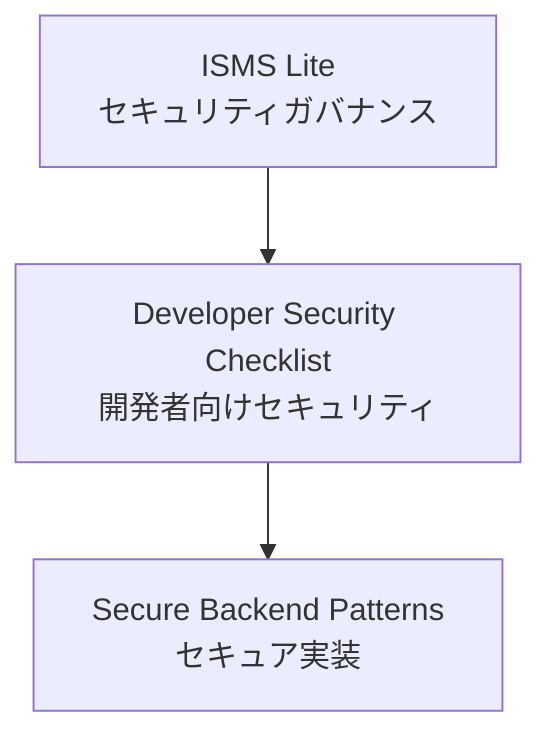

# Startup Security Kit

スタートアップや小規模チーム向けに、軽量ISMS・開発者向けセキュリティチェックリスト・セキュアバックエンド設計をまとめた実践的なセキュリティガイドです。

スタートアップや小規模チーム向けのセキュリティスターターキットです。

多くのセキュリティフレームワークは大企業向けに設計されており、スタートアップにとっては過剰に複雑です。

Startup Security Kit は **小規模チームでも実践できる軽量なセキュリティプラクティス** を提供します。

---

# 特徴

このプロジェクトは3つの主要コンポーネントで構成されています。



### ISMS Lite

小規模チーム向けの軽量ISMSです。

含まれる内容：

* セキュリティポリシーテンプレート
* 情報資産台帳
* リスクアセスメントテンプレート
* インシデント対応ガイド
* 内部監査ガイド

---

### PDCAサイクル

ISMS Lite は、簡略化した PDCAサイクル に基づいて運用されます。

* Plan — セキュリティポリシー策定とリスクアセスメント
* Do — セキュリティ対策の実装と運用
* Check — 内部監査による確認
* Act — 改善とセキュリティ対策の強化

このサイクルにより、小規模チームでも継続的にセキュリティを改善できます。

---

### 開発者向けセキュリティチェックリスト

開発者が設計やレビュー時に利用できる実践的なチェックリストです。

対象トピック：

* 認証
* 認可
* APIセキュリティ
* シークレット管理
* ログ・監視

---

### セキュアバックエンドパターン

バックエンドシステムのセキュリティ設計パターンを紹介します。

例：

* JWT認証設計
* RBAC認可
* セキュアAPI設計
* 監査ログ設計
* シークレット管理

---

# 想定ユーザー

このプロジェクトは以下を対象としています。

* スタートアップ
* 小規模企業（1〜10人）
* 開発者主体のチーム
* バックエンドエンジニア

小規模チームでは専任のセキュリティ担当者がいないことが多いため、実践的なセキュリティガイドを提供します。

---

# クイックスタート

1. セキュリティポリシーテンプレートをコピー
2. 情報資産台帳を作成
3. リスクアセスメントを実施
4. 開発者セキュリティチェックリストを適用

これにより、小規模チームでも基本的なセキュリティ体制を構築できます。

---

# プロジェクト構成

```
startup-security-kit
│
├ README.md
├ README.ja.md
│
├ docs
│
│  ├ en
│  │
│  │  ├ isms-lite
│  │  │   ├ security-policy.md
│  │  │   ├ asset-register.md
│  │  │   ├ risk-assessment.md
│  │  │   ├ incident-response.md
│  │  │   └ internal-audit.md
│  │  │
│  │  ├ checklists
│  │  │   └ developer-security-checklist.md
│  │  │
│  │  └ secure-backend-patterns
│  │      ├ jwt-authentication.md
│  │      ├ rbac-authorization.md
│  │      ├ api-security.md
│  │      ├ audit-logging.md
│  │      └ secret-management.md
│  │
│  └ ja
│      └ 日本語翻訳ドキュメント
```

英語版を主とし、日本語版は翻訳として提供します。

---

# ロードマップ

* [x] ISMS Lite
* [x] 開発者向けセキュリティチェックリスト
* [ ] セキュアバックエンドパターン
* [ ] 脅威モデリング
* [ ] クラウドセキュリティガイド
* [ ] インシデント対応プレイブック

---

# このプロジェクトの背景

多くのセキュリティフレームワークは大企業向けに設計されています。

しかしスタートアップや小規模チームには次のような課題があります。

- 人員が少ない
- セキュリティ専門家がいない
- 限られたリソースで開発を進める必要がある

そのため、大企業向けのセキュリティフレームワークをそのまま導入することは現実的ではありません。

Startup Security Kit は、小規模チームでも実践できる **軽量で実用的なセキュリティプラクティス** を提供することを目的としています。