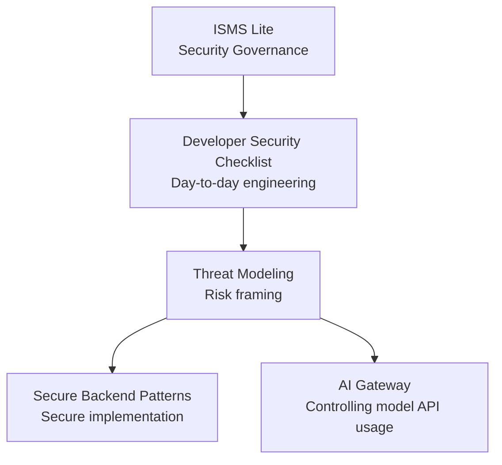

# Startup Security Kit

Practical security guidance for startups and small teams, combining **lightweight ISMS, developer security checklists, secure backend design, and threat modeling**.
It also includes **AI Gateway** documentation (a control-layer perspective on design) when you integrate external model APIs (such as LLMs).

Security starter kit for startups and small teams.

Many security frameworks are designed for large enterprises and are too heavy for startups.

Startup Security Kit focuses on **lightweight and practical security practices** that small teams can adopt.

---

# Features

This project is organized around the following documentation areas.



### ISMS Lite

A lightweight ISMS for small teams.

Includes:

* security policy template
* asset register
* risk assessment template
* incident response guide
* internal audit guide

---

### PDCA Cycle

ISMS Lite follows a simplified PDCA cycle.

* Plan — define security policies and perform risk assessments
* Do — implement security controls and operational procedures
* Check — verify implementation through internal audits
* Act — improve security processes based on findings

This cycle enables small teams to continuously improve their security practices.

---

### Developer Security Checklist

A practical checklist for developers when designing or reviewing systems.

Topics include:

* authentication
* authorization
* API security
* secrets management
* logging and monitoring

---

### Threat Modeling

Guidance for clarifying **what can go wrong (attacks, abuse, misuse)** at the feature or component level, as a prerequisite before deciding **how to defend**. It focuses on making design-level risks visible.

* [Documentation (English)](./docs/en/threat-modeling/README.md)

---

### Secure Backend Patterns

Theme-based security design patterns and operational topics for backend systems.

Examples:

* JWT authentication
* RBAC authorization
* secure API design
* logging and auditing
* tokens and secrets
* CI/CD and supply chain
* tying detection to incident response

* [Index (English)](./docs/en/secure-backend-patterns/README.md)

---

### AI Gateway

Clarifies **where and how** to control input, output, externally transmitted data, and observability when using external model APIs. It focuses on **where this fits in security design**, not product comparisons.

* [Documentation (English)](./docs/en/ai-gateway/README.md)

---

# Target Audience

This project is designed for:

* startups
* small companies (1–10 people)
* developer-led teams
* backend engineers

Many small teams do not have dedicated security engineers.
This project provides practical security guidance for such environments.

---

# Quick Start

1. Copy the security policy template
2. Create your asset register
3. Run a risk assessment
4. Apply the developer security checklist
5. As needed, see [Threat Modeling](./docs/en/threat-modeling/README.md) and [Secure Backend Patterns](./docs/en/secure-backend-patterns/README.md)
6. If you use external model APIs, see [AI Gateway](./docs/en/ai-gateway/README.md)

This provides a basic security foundation for small teams.

---

# Project Structure

```
startup-security-kit
│
├ README.md
├ README.ja.md
│
├ docs
│  │
│  ├ ai-review
│  │   └ ai-review.md
│  │
│  ├ en
│  │   ├ project-plan.md
│  │   │
│  │   ├ isms-lite
│  │   │   ├ README.md
│  │   │   ├ security-policy.md
│  │   │   ├ asset-register.md
│  │   │   ├ risk-assessment.md
│  │   │   ├ incident-response.md
│  │   │   └ internal-audit.md
│  │   │
│  │   ├ checklists
│  │   │   ├ README.md
│  │   │   └ developer-security-checklist.md
│  │   │
│  │   ├ threat-modeling
│  │   │   ├ README.md
│  │   │   └ overview.md
│  │   │
│  │   ├ ai-gateway
│  │   │   ├ README.md
│  │   │   └ overview.md
│  │   │
│  │   └ secure-backend-patterns
│  │       ├ README.md
│  │       ├ jwt-authentication.md
│  │       ├ rbac-authorization.md
│  │       ├ api-security.md
│  │       ├ logging-audit.md
│  │       ├ token-secret.md
│  │       ├ dependency-security.md
│  │       ├ ci-cd.md
│  │       ├ credential-compromise-supply-chain.md
│  │       └ detection-and-response.md
│  │
│  └ ja
│      └ (Japanese translations matching the layout above)
│
└ templates
    └ claude
        └ skills
            └ ssk-security-review
                └ SKILL.md
```

English documents are the primary source; Japanese versions are translations. For positioning and roadmap details, see the [project plan](./docs/en/project-plan.md).

---

# Roadmap

* [x] v0.1 — ISMS Lite (templates)
* [x] v0.2 — Developer Security Checklist
* [x] v0.3 — Secure Backend Patterns (multiple guides)
* [x] v0.4 — Threat Modeling
* [x] v0.5 — AI Gateway (security design for external model API usage)
* [ ] Future extensions — cloud security, DevSecOps, incident response playbooks, and more (see [project plan](./docs/en/project-plan.md))

---

# Why This Project Exists

Most security frameworks target large enterprises.

However, startups and small teams face different challenges:

* limited resources
* small engineering teams
* lack of security specialists

Adopting an enterprise framework as-is is often unrealistic.

Startup Security Kit provides **practical security guidance designed for small teams.**

---

# Claude Code Integration

1. Add Startup Security Kit

```bash
git submodule add https://github.com/st-hisatoshi-2973/startup-security-kit.git startup-security-kit
git commit -m "Add startup-security-kit as submodule"
```

2. Setup Claude skills

```bash
cp -r startup-security-kit/templates/claude .claude
```

3. Run

```bash
/ssk-security-review
```

---

# License

MIT
